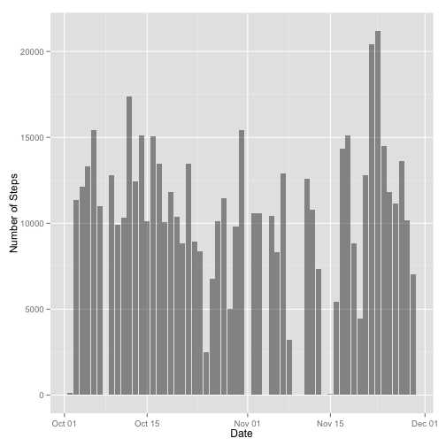
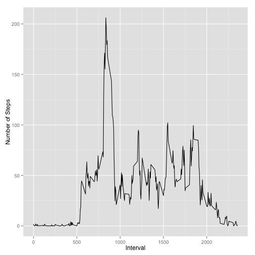
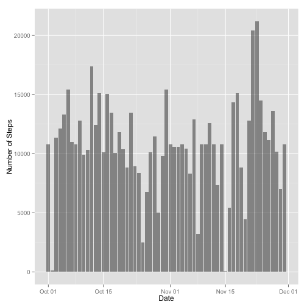
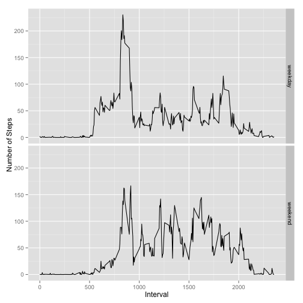

---
output:
  html_document:
    keep_md: yes
---
# Reproducible Research: Peer Assessment 1


## Loading and preprocessing the data


```r
Sys.setlocale('LC_ALL', 'C')
library(ggplot2)
```

```r
activity <- read.csv(unz('activity.zip', 'activity.csv'),
                     stringsAsFactors = FALSE)
activity$date <- as.Date(activity$date)
```


## What is mean total number of steps taken per day?


```r
stepsbydate <- aggregate(steps ~ date, data=activity, FUN=sum)
ggplot(stepsbydate, aes(x=date, y=steps)) +
    geom_histogram(alpha=.5, stat="identity") +
    ylab('Number of Steps') +
    xlab('Date')
```

 

```r
mean(stepsbydate$steps, na.rm=T)
```

```
## [1] 10766
```

```r
median(stepsbydate$steps, na.rm=T)
```

```
## [1] 10765
```


## What is the average daily activity pattern?


```r
stepsbyinterval <- aggregate(steps ~ interval, data=activity, FUN=mean)
ggplot(stepsbyinterval, aes(x=interval, y=steps)) +
    geom_line() +
    ylab('Number of Steps') +
    xlab('Interval')
```

 

```r
maxrow <- stepsbyinterval$steps == max(stepsbyinterval$steps)
stepsbyinterval[maxrow,]$interval
```

```
## [1] 835
```


## Imputing missing values

There are several missing values in the dataset and they might distort the
analysis. The number of NA values is:

```r
sum(is.na(activity$steps))
```

```
## [1] 2304
```

Imputing the missing values may smooth the graphics. These NA values are now
replaced with the average of steps by interval throughout all the days. The
averages of the number of steps per interval used in the imputation were
calculated in the previous section.

```r
activitynona <- merge(activity, stepsbyinterval, 'interval')
nasteps <- is.na(activitynona$steps.x)
activitynona$steps.x[nasteps] <- activitynona$steps.y[nasteps]
colnames(activitynona)[2] <- 'steps'

stepsbydatenona <- aggregate(steps ~ date, data=activitynona, FUN=sum)
ggplot(stepsbydatenona, aes(x=date, y=steps)) +
    geom_histogram(alpha=.5, stat="identity") +
    ylab('Number of Steps') +
    xlab('Date')
```

 

```r
mean(stepsbydatenona$steps)
```

```
## [1] 10766
```

```r
median(stepsbydatenona$steps)
```

```
## [1] 10766
```


## Are there differences in activity patterns between weekdays and weekends?


```r
isweekend <- weekdays(activitynona$date, abbreviate=T) %in% c('Sat','Sun')
activitynona$daytype[isweekend] <- 'weekend'
activitynona$daytype[!isweekend] <- 'weekday'
activitynona$daytype <- as.factor(activitynona$daytype)

stepsbyintervalnona <- aggregate(steps ~ interval + daytype,
                                 data=activitynona, FUN=mean)
ggplot(stepsbyintervalnona, aes(x=interval, y=steps)) +
    geom_line() +
    facet_grid(daytype ~ .) +
    ylab('Number of Steps') +
    xlab('Interval')
```

 

